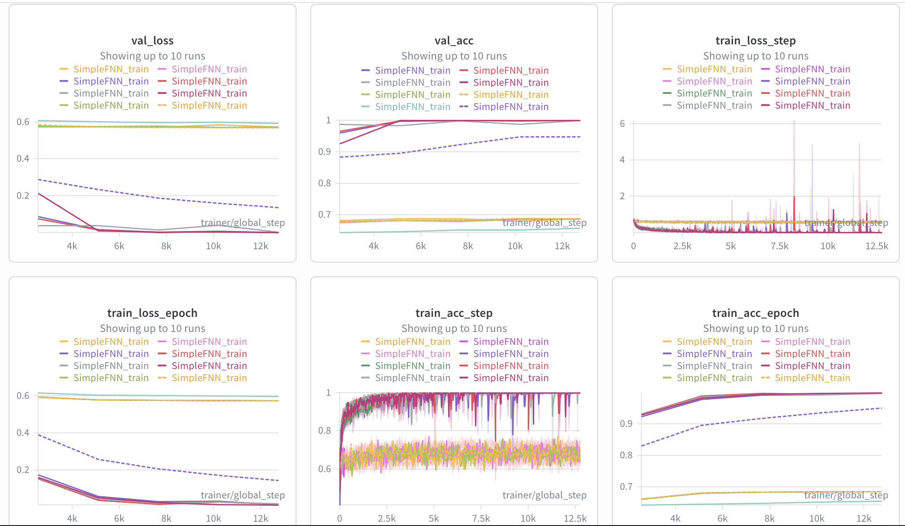
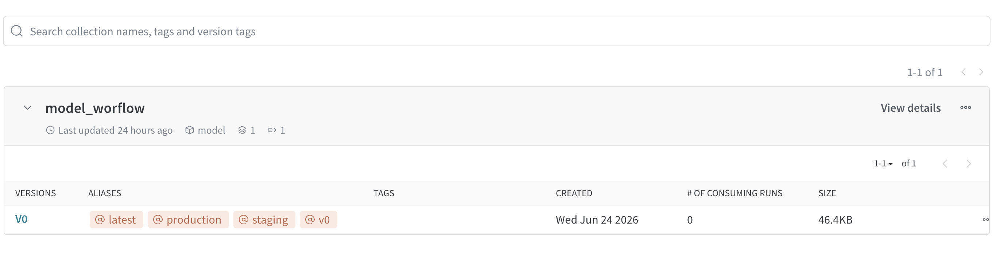
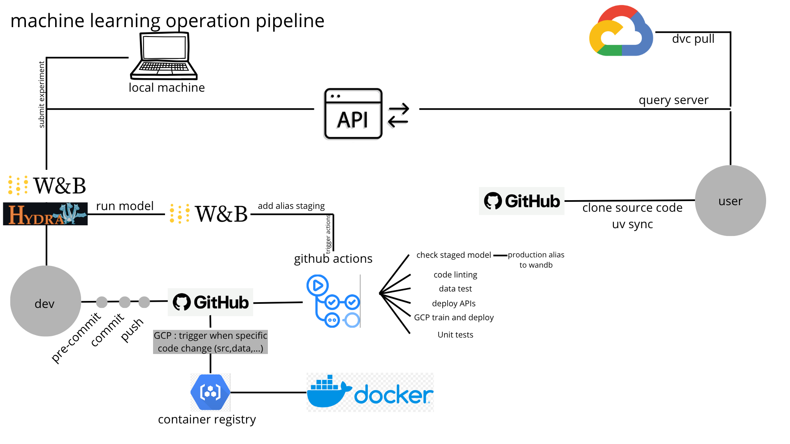

# Exam template for 02476 Machine Learning Operations

This is the report template for the exam. Please only remove the text formatted as with three dashes in front and behind
like:

```--- question 1 fill here ---```

Where you instead should add your answers. Any other changes may have unwanted consequences when your report is
auto-generated at the end of the course. For questions where you are asked to include images, start by adding the image
to the `figures` subfolder (please only use `.png`, `.jpg` or `.jpeg`) and then add the following code in your answer:

``

In addition to this markdown file, we also provide the `report.py` script that provides two utility functions:

Running:

```bash
python report.py html
```

Will generate a `.html` page of your report. After the deadline for answering this template, we will auto-scrape
everything in this `reports` folder and then use this utility to generate a `.html` page that will be your serve
as your final hand-in.

Running

```bash
python report.py check
```

Will check your answers in this template against the constraints listed for each question e.g. is your answer too
short, too long, or have you included an image when asked. For both functions to work you mustn't rename anything.
The script has two dependencies that can be installed with

```bash
pip install typer markdown
```

or

```bash
uv add typer markdown
```

## Overall project checklist

The checklist is *exhaustive* which means that it includes everything that you could do on the project included in the
curriculum in this course. Therefore, we do not expect at all that you have checked all boxes at the end of the project.
The parenthesis at the end indicates what module the bullet point is related to. Please be honest in your answers, we
will check the repositories and the code to verify your answers.

### Week 1

* [ ] Create a git repository (M5)
* [ ] Make sure that all team members have write access to the GitHub repository (M5)
* [ ] Create a dedicated environment for you project to keep track of your packages (M2)
* [ ] Create the initial file structure using cookiecutter with an appropriate template (M6)
* [ ] Fill out the `data.py` file such that it downloads whatever data you need and preprocesses it (if necessary) (M6)
* [ ] Add a model to `model.py` and a training procedure to `train.py` and get that running (M6)
* [ ] Remember to either fill out the `requirements.txt`/`requirements_dev.txt` files or keeping your
    `pyproject.toml`/`uv.lock` up-to-date with whatever dependencies that you are using (M2+M6)
* [ ] Remember to comply with good coding practices (`pep8`) while doing the project (M7)
* [ ] Do a bit of code typing and remember to document essential parts of your code (M7)
* [ ] Setup version control for your data or part of your data (M8)
* [ ] Add command line interfaces and project commands to your code where it makes sense (M9)
* [ ] Construct one or multiple docker files for your code (M10)
* [ ] Build the docker files locally and make sure they work as intended (M10)
* [ ] Write one or multiple configurations files for your experiments (M11)
* [ ] Used Hydra to load the configurations and manage your hyperparameters (M11)
* [ ] Use profiling to optimize your code (M12)
* [ ] Use logging to log important events in your code (M14)
* [ ] Use Weights & Biases to log training progress and other important metrics/artifacts in your code (M14)
* [ ] Consider running a hyperparameter optimization sweep (M14)
* [ ] Use PyTorch-lightning (if applicable) to reduce the amount of boilerplate in your code (M15)

### Week 2

* [ ] Write unit tests related to the data part of your code (M16)
* [ ] Write unit tests related to model construction and or model training (M16)
* [ ] Calculate the code coverage (M16)
* [ ] Get some continuous integration running on the GitHub repository (M17)
* [ ] Add caching and multi-os/python/pytorch testing to your continuous integration (M17)
* [ ] Add a linting step to your continuous integration (M17)
* [ ] Add pre-commit hooks to your version control setup (M18)
* [ ] Add a continues workflow that triggers when data changes (M19)
* [ ] Add a continues workflow that triggers when changes to the model registry is made (M19)
* [ ] Create a data storage in GCP Bucket for your data and link this with your data version control setup (M21)
* [ ] Create a trigger workflow for automatically building your docker images (M21)
* [ ] Get your model training in GCP using either the Engine or Vertex AI (M21)
* [ ] Create a FastAPI application that can do inference using your model (M22)
* [ ] Deploy your model in GCP using either Functions or Run as the backend (M23)
* [ ] Write API tests for your application and setup continues integration for these (M24)
* [ ] Load test your application (M24)
* [ ] Create a more specialized ML-deployment API using either ONNX or BentoML, or both (M25)
* [ ] Create a frontend for your API (M26)

### Week 3

* [ ] Check how robust your model is towards data drifting (M27)
* [ ] Setup collection of input-output data from your deployed application (M27)
* [ ] Deploy to the cloud a drift detection API (M27)
* [ ] Instrument your API with a couple of system metrics (M28)
* [ ] Setup cloud monitoring of your instrumented application (M28)
* [ ] Create one or more alert systems in GCP to alert you if your app is not behaving correctly (M28)
* [ ] If applicable, optimize the performance of your data loading using distributed data loading (M29)
* [ ] If applicable, optimize the performance of your training pipeline by using distributed training (M30)
* [ ] Play around with quantization, compilation and pruning for you trained models to increase inference speed (M31)

### Extra

* [ ] Write some documentation for your application (M32)
* [ ] Publish the documentation to GitHub Pages (M32)
* [ ] Revisit your initial project description. Did the project turn out as you wanted?
* [ ] Create an architectural diagram over your MLOps pipeline
* [ ] Make sure all group members have an understanding about all parts of the project
* [ ] Uploaded all your code to GitHub

## Group information

### Question 1
> **Enter the group number you signed up on <learn.inside.dtu.dk>**
>
> Answer: special course

--- question 1 fill here ---

### Question 2
> **Enter the study number for each member in the group**
>
> Example:
>
> *sXXXXXX, sXXXXXX, sXXXXXX*
>
> Answer:s243576, s214584, s224014, s214604

--- question 2 fill here ---

### Question 3
> **Did you end up using any open-source frameworks/packages not covered in the course during your project? If so**
> **which did you use and how did they help you complete the project?**
>
> Recommended answer length: 0-200 words.
>
> Example:
> *We used the third-party framework ... in our project. We used functionality ... and functionality ... from the*
> *package to do ... and ... in our project*.
>
> Answer: no we essentially used the course libraries, they are already very complete and can take the project as far as possible.

--- question 3 fill here ---

## Coding environment

> In the following section we are interested in learning more about you local development environment. This includes
> how you managed dependencies, the structure of your code and how you managed code quality.

### Question 4

> **Explain how you managed dependencies in your project? Explain the process a new team member would have to go**
> **through to get an exact copy of your environment.**
>
> Recommended answer length: 100-200 words
>
> Example:
> *We used ... for managing our dependencies. The list of dependencies was auto-generated using ... . To get a*
> *complete copy of our development environment, one would have to run the following commands*
>
> Answer:
We use uv as our package manager with a pyproject.toml defining all dependencies and a uv.lock lockfile that pins exact versions of every package.

A new team member would run:


git clone <repo>
cd bj_21
uv sync --locked --dev
That's it. uv sync --locked reads the lockfile and installs the exact same versions of every dependency

For the environment to be fully functional they also need:

Data — run dvc pull to fetch the dataset from Google Cloud Storage (requires GCP credentials)
W&B — run wandb login and paste their API key
Pre-commit hooks — run pre-commit install to enable automatic code formatting on commit
The lockfile (uv.lock) is committed to the repository, so the environment is fully reproducible across machines and operating systems — the same command on Mac, Linux, or Windows gives an identical Python environment.


--- question 4 fill here ---

### Question 5

> **We expect that you initialized your project using the cookiecutter template. Explain the overall structure of your**
> **code. What did you fill out? Did you deviate from the template in some way?**
>
> Recommended answer length: 100-200 words
>
> Example:
> *From the cookiecutter template we have filled out the ... , ... and ... folder. We have removed the ... folder*
> *because we did not use any ... in our project. We have added an ... folder that contains ... for running our*
> *experiments.*
>
> Answer:

From the cookiecutter template we kept the overall structure: src/, tests/, models/, configs/, dockerfiles/, docs/, reports/, notebooks/, .github/workflows/, .pre-commit-config.yaml, pyproject.toml and .gitignore.

We filled out the src/blackjack_predictor/ package with train.py, evaluate.py, tasks.py, api.py, improve_speed.py, profiling.py, run_sweep.py and a models/ subfolder containing ffnn.py. We also added a data_/ subfolder with dataset.py, datamodule.py, preprocessing.py and dataset_statistics.py. The tests/ folder was filled with test_model.py, test_data.py, test_api.py and test_production.py.

We deviated from the template in several ways. We renamed project_name to blackjack_predictor and split the data logic into a dedicated data_/ subpackage instead of a single data.py. We added a configs/ folder with Hydra config groups (model_config/, training_config/, data_config/, profiling_config/) which was not in the template. We also added .dvc/ and data.dvc for dataset versioning, a cloudbuild.yaml for GCP deployment, and additional GitHub Actions workflows (cml_data.yaml, stage_model.yaml) beyond the template's linting.yaml and tests.yaml

### Question 6

> **Did you implement any rules for code quality and format? What about typing and documentation? Additionally,**
> **explain with your own words why these concepts matters in larger projects.**
>
> Recommended answer length: 100-200 words.
>
> Example:
> *We used ... for linting and ... for formatting. We also used ... for typing and ... for documentation. These*
> *concepts are important in larger projects because ... . For example, typing ...*
>
> Answer:
Code quality and formatting is enforced through two layers:

Pre-commit hooks (.pre-commit-config.yaml) that run automatically on every git commit:

ruff — linting, catches unused imports, bad practices, style violations
ruff-format — automatic code formatting (replaces Black)
trailing-whitespace and end-of-file-fixer — minor file hygiene
GitHub Actions (.github/workflows/linting.yaml) — runs ruff on every push so CI fails if formatting is wrong, even if someone bypassed pre-commit locally.

GitHub actions :

GitHub Actions CI (.github/workflows/linting.yaml), runs ruff on every push to main / merge across multiple Python versions (3.12, 3.13) and OS (Ubuntu, macOS). CI fails if formatting is wrong, even if someone bypassed pre-commit locally. This acts as a safety net for the whole team.

In a team of one or two people you can keep style consistent in your head. In a larger project with 10+ developers committing daily, inconsistent formatting creates noisy diffs where you can't tell what actually changed vs. what was just reformatted. It will still be in the branch but will appear with a red cross, in a real production system you will have someone assigned for code review, and if it does pass all the test it will then be prossible to merge the branch. Pre-commit hooks enforce a single style automatically so no one has to argue about it in code review.

Documentation matters for onboarding, a new team member should be able to understand what a function does without reading its full implementation. In production systems, undocumented code becomes unmaintainable once the original author leaves.

--- question 6 fill here ---

## Version control

> In the following section we are interested in how version control was used in your project during development to
> corporate and increase the quality of your code.

### Question 7

> **How many tests did you implement and what are they testing in your code?**
>
> Recommended answer length: 50-100 words.
>
> Example:
> *In total we have implemented X tests. Primarily we are testing ... and ... as these the most critical parts of our*
> *application but also ... .*
>
> Answer:

In total we have implemented 10 tests across 3 active test files. test_model.py (2 tests) tests that the model produces the correct output shape (batch, 2) and that 100 forward passes on the W&B registry model complete within a time limit. test_data.py (3 tests) tests that the dataset correctly loads a .pt tensor file, raises an error when the file is missing, and that the datamodule correctly splits data and returns working dataloaders. test_api.py (5 tests) tests that the FastAPI /predict endpoint returns valid probabilities, correctly rejects out-of-range card values with a 422 error, that the /health endpoint responds, and that the /monitoring/drift endpoint handles missing or insufficient logs correctly.

--- question 7 fill here ---

### Question 8

> **What is the total code coverage (in percentage) of your code? If your code had a code coverage of 100% (or close**
> **to), would you still trust it to be error free? Explain you reasoning.**
>
> Recommended answer length: 100-200 words.
>
> Example:
> *The total code coverage of code is X%, which includes all our source code. We are far from 100% coverage of our **
> *code and even if we were then...*
>
> Answer:
The total code coverage of our code is 78%, covering the model, dataset, datamodule, and API source files. The main uncovered areas are the Evidently drift detection logic in api.py (which requires real production log data to exercise) and minor edge case branches in dataset.py and ffnn.py.

Even if we achieved 100% coverage, we would not trust the code to be entirely error-free. Coverage only measures that a line was executed during tests — not that it produced the correct result. A test can call every line of a function while asserting nothing meaningful. Moreover, 100% coverage cannot catch integration failures between components (e.g. a model trained with the wrong number of features being served by the API), data distribution shifts at inference time, or race conditions under concurrent requests.

--- question 8 fill here ---

### Question 9

> **Did you workflow include using branches and pull requests? If yes, explain how. If not, explain how branches and**
> **pull request can help improve version control.**
>
> Recommended answer length: 100-200 words.
>
> Example:
> *We made use of both branches and PRs in our project. In our group, each member had an branch that they worked on in*
> *addition to the main branch. To merge code we ...*
>
> Answer:
Yes, we made use of branches and pull requests in our project. The key design decision is visible directly in our workflows — every CI workflow (tests.yaml, linting.yaml, cml_data.yaml) is configured to trigger on both push to main and pull requests targeting main:

on:
  push:
    branches: [main]
  pull_request:
    branches: [main]
This means main is treated as a protected production branch — no code will pass the test without passing all the workflow, however it keeps the push and update main, an other file will be necessary in production to run first the check and then if it works and someone approve the code review it can be merge to the main.

This is valuable because main always represents a working, deployable state. If a developer introduces a breaking change on a feature branch, it fails CI on the PR and never reaches main. This is especially important in ML projects where a subtle bug — like a wrong input dimension — can silently pass locally but fail in the deployment pipeline. Branches give each developer an isolated workspace, and the PR + CI gate ensures only verified code enters the shared production branch.

--- question 9 fill here ---

### Question 10

> **Did you use DVC for managing data in your project? If yes, then how did it improve your project to have version**
> **control of your data. If no, explain a case where it would be beneficial to have version control of your data.**
>
> Recommended answer length: 100-200 words.
>
> Example:
> *We did make use of DVC in the following way: ... . In the end it helped us in ... for controlling ... part of our*
> *pipeline*
>
> Answer:
Yes, we made use of DVC to version control our dataset. The raw dataset (data/raw/blkjckhands.csv, ~60MB) is tracked via a data.dvc file committed to Git, with the actual data stored remotely on Google Cloud Storage (gs://mlops_data_bucket). This means the repository stays lightweight — Git only tracks a small metadata file containing the MD5 hash and size, while the actual data lives in the cloud.

The main benefit was reproducibility: any team member or CI runner can retrieve the exact version of the dataset that corresponds to a given commit by running dvc pull. Without DVC, there is no way to know which version of the data produced a given model artifact.

In our CI pipeline, the cml_data.yaml workflow uses dvc pull to fetch the data before running dataset statistics and posting them as a PR comment, ensuring the reported statistics always match the versioned dataset.

--- question 10 fill here ---

### Question 11

> **Discuss your continuous integration setup. What kind of continuous integration are you running (unittesting,**
> **linting, etc.)? Do you test multiple operating systems, Python  version etc. Do you make use of caching? Feel free**
> **to insert a link to one of your GitHub actions workflow.**
>
> Recommended answer length: 200-300 words.
>
> Example:
> *We have organized our continuous integration into 3 separate files: one for doing ..., one for running ... testing*
> *and one for running ... . In particular for our ..., we used ... .An example of a triggered workflow can be seen*
> *here: <weblink>*
>
> Answer:
We have organized our continuous integration into 4 separate GitHub Actions workflow files:

1. linting.yaml — runs ruff for code formatting and style checks on every push. It runs across a matrix of 3 operating systems (Ubuntu, macOS, windows) and 2 Python versions (3.12, 3.13), giving 6 parallel jobs. This ensures our code is compatible across environments.

2. tests.yaml — runs pytest with coverage on every push, executing unit tests for the model forward pass, dataset loading, and API endpoints. It uses actions/cache to cache the .venv virtual environment keyed on the uv.lock hash, so dependencies are only reinstalled when they actually change — significantly speeding up CI runs.

3. cml_data.yaml — triggers on pull requests to main. It authenticates with GCP, pulls the versioned dataset via dvc pull, runs preprocessing, computes dataset statistics, and posts a markdown report as a PR comment using the CML framework. This gives reviewers visibility into data quality before merging.

4. stage_model.yaml — triggered by a repository_dispatch event sent by W&B when a model is given the staging alias in the model registry. It runs a speed test (test_model_speed) on the staged model and, if it passes, automatically promotes it to production by calling tests/test_production.py. This creates a fully automated model deployment pipeline.

All workflows use astral-sh/setup-uv with enable-cache: true and uv sync --locked to ensure reproducible, fast dependency installation across all runs.
--- question 11 fill here ---

## Running code and tracking experiments

> In the following section we are interested in learning more about the experimental setup for running your code and
> especially the reproducibility of your experiments.

### Question 12

> **How did you configure experiments? Did you make use of config files? Explain with coding examples of how you would**
> **run a experiment.**
>
> Recommended answer length: 50-100 words.
>
> Example:
> *We used a simple argparser, that worked in the following way: Python  my_script.py --lr 1e-3 --batch_size 25*
>
> Answer:
We used Hydra for experiment configuration with separate config group files organized as:


configs/
  config.yaml              # root config combining all groups
  model_config/default.yaml    # input_dim, hidden_dim, output_dim
  training_config/default.yaml # lr, max_epochs, batch_size
  data_config/default.yaml     # processed_path, model_path
  profiling_config/default.yaml

To run a default experiment:
uv run src/blackjack_predictor/train.py

To override parameters without editing files:
uv run src/blackjack_predictor/train.py training_config.lr=0.001 training_config.max_epochs=10 model_config.hidden_dim=256

Hydra automatically logs all hyperparameters to W&B and saves run outputs to timestamped outputs/ directories, making every experiment fully reproducible.


--- question 12 fill here ---

### Question 13

> **Reproducibility of experiments are important. Related to the last question, how did you secure that no information**
> **is lost when running experiments and that your experiments are reproducible?**
>
> Recommended answer length: 100-200 words.
>
> Example:
> *We made use of config files. Whenever an experiment is run the following happens: ... . To reproduce an experiment*
> *one would have to do ...*
>
> Answer:
We secured reproducibility through three mechanisms:

1. Hydra config logging — every experiment run serializes the full config to W&B via OmegaConf.to_container(cfg, resolve=True). This means every W&B run stores the exact lr, batch_size, max_epochs, hidden_dim, and all other parameters used.

2. Fixed data split seed — datamodule.py uses torch.Generator().manual_seed(self.split_seed) with split_seed=42 defined in training_config/default.yaml. This ensures the train/val/test split is identical across runs, so model comparisons are fair.

3. Model artifact logging — after training, the model weights are saved and logged to W&B as a versioned artifact (blackjack-model:v0, v1, etc.). This links the exact weights to the exact config that produced them, and the person can see which hyperparameter has been used.

To reproduce an experiment, one would:

# find the config from the W&B run, then:
uv run src/blackjack_predictor/train.py \
  training_config.lr=0.003 \
  training_config.max_epochs=5 \
  model_config.hidden_dim=128
Hydra also saves each run's resolved config to outputs/<date>/<time>/ locally as a backup.

--- question 13 fill here ---

### Question 14

> **Upload 1 to 3 screenshots that show the experiments that you have done in W&B (or another experiment tracking**
> **service of your choice). This may include loss graphs, logged images, hyperparameter sweeps etc. You can take**
> **inspiration from [this figure](figures/wandb.png). Explain what metrics you are tracking and why they are**
> **important.**
>
> Recommended answer length: 200-300 words + 1 to 3 screenshots.
>
> Example:
> *As seen in the first image when have tracked ... and ... which both inform us about ... in our experiments.*
> *As seen in the second image we are also tracking ... and ...*
>
> Answer:
First, we focused on tracking training metrics and model reproducibility. For each training run we logged train loss and validation loss to W&B, which allow us to monitor whether the model is learning correctly and detect overfitting.

We also implemented a full model reproducibility pipeline. After each training run, the model is saved as a W&B artifact. When a model is manually given the staging alias in the W&B registry, it automatically triggers a GitHub Actions workflow (stage_model.yaml) that runs a speed test on the model. If it passes, the workflow automatically promotes it to production by adding the production alias. This way the team can always identify which model version is deployed in production and trace it back to the exact training run and hyperparameters that produced it.

Finally, to see the best performance of the models with which parameters works the best, we implemented an hyperparameter optimization on the following parameters learning rate, batch size and hidden dimension. 

Below are screenshots showing our W&B implementation:



put the picture of the sweep data 


--- question 14 fill here ---

### Question 15

> **Docker is an important tool for creating containerized applications. Explain how you used docker in your**
> **experiments/project? Include how you would run your docker images and include a link to one of your docker files.**
>
> Recommended answer length: 100-200 words.
>
> Example:
> *For our project we developed several images: one for training, inference and deployment. For example to run the*
> *training docker image: `docker run trainer:latest lr=1e-3 batch_size=64`. Link to docker file: <weblink>*
>
> Answer:
For our project we developed three Docker images, all using ghcr.io/astral-sh/uv:python3.12-bookworm-slim as the base image with uv for fast dependency installation:

1. Training image (train_uv.dockerfile) — copies the source code and data, installs dependencies via uv sync, and runs train.py as the entrypoint. The dev can run the following bash file to run the docker which will build and run the image.


bash dockerfiles/train.sh
# which runs:
docker build -f dockerfiles/train_uv.dockerfile . -t train:project
docker run -v $(pwd)/models:/models train:project
2. Evaluation image (evaluate_uv.dockerfile) — copies both source code and pre-trained models, runs evaluate.py:


docker build -f dockerfiles/evaluate_uv.dockerfile . -t evaluate:project
docker run evaluate:project
3. API inference image (api_uv.dockerfile) — serves the FastAPI endpoint on port 8080 using uvicorn:


docker build -f dockerfiles/api_uv.dockerfile . -t api:project
docker run -p 8080:8080 api:project
The training image uses --mount=type=cache,target=/root/.cache/uv to cache the uv package cache across builds, significantly speeding up rebuilds when only source code changes. All images use uv sync --frozen to guarantee the exact locked dependency versions are installed.

--- question 15 fill here ---

### Question 16

> **When running into bugs while trying to run your experiments, how did you perform debugging? Additionally, did you**
> **try to profile your code or do you think it is already perfect?**
>
> Recommended answer length: 100-200 words.
>
> Example:
> *Debugging method was dependent on group member. Some just used ... and others used ... . We did a single profiling*
> *run of our main code at some point that showed ...*
>
> Answer:

There is no explicit debugging tooling in the codebase (no pdb, no debug flags). Debugging was done primarily through print statements and reading error tracebacks directly — for example, print(f"Loaded dataset splits: train={len(dm.train_dataset)}") in train.py to confirm data loading worked correctly.

For profiling however, we implemented a dedicated profiling.py script using torch.profiler. It profiles four stages of the pipeline — dataset initialization, dataloader construction, data loading, and model inference — and prints a breakdown showing CPU time, average time per call, and percentage of total pipeline time per stage. This was run with:

uv run src/blackjack_predictor/profiling.py

The profiling revealed that for our small model, data loading dominates inference time, which motivated switching from CSV to .pt tensor format for processed data, a concrete improvement driven by profiling results.

--- question 16 fill here ---

## Working in the cloud

> In the following section we would like to know more about your experience when developing in the cloud.

### Question 17

> **List all the GCP services that you made use of in your project and shortly explain what each service does?**
>
> Recommended answer length: 50-200 words.
>
> Example:
> *We used the following two services: Engine and Bucket. Engine is used for... and Bucket is used for...*
>
> Answer:
We used the following three GCP services:

1. Cloud Storage (GCS) — the bucket gs://mlops_data_bucket stores the versioned dataset managed by DVC. When CI runs, it authenticates with GCP via a service account key (GCP_SA_KEY) and pulls the raw CSV from this bucket before running data statistics.

2. Artifact Registry — stores Docker container images built by Cloud Build, hosted at europe-west1-docker.pkg.dev/$PROJECT_ID/dtumlops/blackjack-train. It acts as a private Docker registry within GCP.

3. Cloud Build + Cloud Run — defined in cloudbuild.yaml, Cloud Build automatically builds the training Docker image and pushes it to Artifact Registry. Cloud Run then deploys the blackjack-predictor-api container as a serverless endpoint on port 8080 in europe-west1, with 2 CPUs and 2Gi memory, accessible without authentication. This allows the FastAPI inference endpoint to be deployed and scaled automatically without managing servers.

--- question 17 fill here ---

### Question 18

> **The backbone of GCP is the Compute engine. Explained how you made use of this service and what type of VMs**
> **you used?**
>
> Recommended answer length: 100-200 words.
>
> Example:
> *We used the compute engine to run our ... . We used instances with the following hardware: ... and we started the*
> *using a custom container: ...*
>
> Answer: We did not manually provision raw Compute Engine instances (like SSH-ing into a persistent VM). Instead, we used Vertex AI Custom Training Jobs, which dynamically provisions Compute Engine resources under the hood. As seen in our submit_vertex_training.sh script, we trigger training by submitting our custom Docker container (blackjack-train:latest) to Vertex AI. Vertex AI reads our blackjack_train_custom_job.yaml specification, automatically spins up a Compute Engine instance (an e2-standard-4 machine type) to execute the container, and automatically tears down the VM when the training script finishes. This allowed us to leverage GCP's heavy compute power for training without the overhead of manually managing the VM lifecycle or paying for idle compute time.

--- question 18 fill here ---

### Question 19

> **Insert 1-2 images of your GCP bucket, such that we can see what data you have stored in it.**
> **You can take inspiration from [this figure](figures/bucket.png).**
>
> Answer:

--- question 19 fill here ---

### Question 20

> **Upload 1-2 images of your GCP artifact registry, such that we can see the different docker images that you have**
> **stored. You can take inspiration from [this figure](figures/registry.png).**
>
> Answer:

--- question 20 fill here ---

### Question 21

> **Upload 1-2 images of your GCP cloud build history, so we can see the history of the images that have been build in**
> **your project. You can take inspiration from [this figure](figures/build.png).**
>
> Answer:

--- question 21 fill here ---

### Question 22

> **Did you manage to train your model in the cloud using either the Engine or Vertex AI? If yes, explain how you did**
> **it. If not, describe why.**
>
> Recommended answer length: 100-200 words.
>
> Example:
> *We managed to train our model in the cloud using the Engine. We did this by ... . The reason we choose the Engine*
> *was because ...*
>
> Answer:

--- question 22 fill here ---

## Deployment

### Question 23

> **Did you manage to write an API for your model? If yes, explain how you did it and if you did anything special. If**
> **not, explain how you would do it.**
>
> Recommended answer length: 100-200 words.
>
> Example:
> *We did manage to write an API for our model. We used FastAPI to do this. We did this by ... . We also added ...*
> *to the API to make it more ...*
>
> Answer:

--- question 23 fill here ---

### Question 24

> **Did you manage to deploy your API, either in locally or cloud? If not, describe why. If yes, describe how and**
> **preferably how you invoke your deployed service?**
>
> Recommended answer length: 100-200 words.
>
> Example:
> *For deployment we wrapped our model into application using ... . We first tried locally serving the model, which*
> *worked. Afterwards we deployed it in the cloud, using ... . To invoke the service an user would call*
> *`curl -X POST -F "file=@file.json"<weburl>`*
>
> Answer:

--- question 24 fill here ---

### Question 25

> **Did you perform any functional testing and load testing of your API? If yes, explain how you did it and what**
> **results for the load testing did you get. If not, explain how you would do it.**
>
> Recommended answer length: 100-200 words.
>
> Example:
> *For functional testing we used pytest with httpx to test our API endpoints and ensure they returned the correct*
> *responses. For load testing we used locust with 100 concurrent users. The results of the load testing showed that*
> *our API could handle approximately 500 requests per second before the service crashed.*
>
> Answer:

--- question 25 fill here ---

### Question 26

> **Did you manage to implement monitoring of your deployed model? If yes, explain how it works. If not, explain how**
> **monitoring would help the longevity of your application.**
>
> Recommended answer length: 100-200 words.
>
> Example:
> *We did not manage to implement monitoring. We would like to have monitoring implemented such that over time we could*
> *measure ... and ... that would inform us about this ... behaviour of our application.*
>
> Answer:

--- question 26 fill here ---

## Overall discussion of project

> In the following section we would like you to think about the general structure of your project.

### Question 27

> **How many credits did you end up using during the project and what service was most expensive? In general what do**
> **you think about working in the cloud?**
>
> Recommended answer length: 100-200 words.
>
> Example:
> *Group member 1 used ..., Group member 2 used ..., in total ... credits was spend during development. The service*
> *costing the most was ... due to ... . Working in the cloud was ...*
>
> Answer:

--- question 27 fill here ---

### Question 28

> **Did you implement anything extra in your project that is not covered by other questions? Maybe you implemented**
> **a frontend for your API, use extra version control features, a drift detection service, a kubernetes cluster etc.**
> **If yes, explain what you did and why.**
>
> Recommended answer length: 0-200 words.
>
> Example:
> *We implemented a frontend for our API. We did this because we wanted to show the user ... . The frontend was*
> *implemented using ...*
>
> Answer:

We implemented a Python script improve_speed.py which loads the saved model, applies global unstructured pruning to remove the smallest weights across all linear layers, and saves the resulting pruned model. The file also includes a speed benchmark that runs both the original and pruned model on multiple batch sizes (1, 32, 256, 1024) and compares inference time. In our case, pruning is not relevant — the speedup was negligible (1.00x–1.19x) because our model is a simple 3-layer network that already runs in microseconds. Pruning is designed for large models where zeroing weights reduces meaningful computation, which is not the case here

--- question 28 fill here ---

### Question 29

> **Include a figure that describes the overall architecture of your system and what services that you make use of.**
> **You can take inspiration from [this figure](figures/overview.png). Additionally, in your own words, explain the**
> **overall steps in figure.**
>
> Recommended answer length: 200-400 words
>
> Example:
>
> *The starting point of the diagram is our local setup, where we integrated ... and ... and ... into our code.*
> *Whenever we commit code and push to GitHub, it auto triggers ... and ... . From there the diagram shows ...*
>
> Answer:

The starting point of the diagram is the local setup, where all development is done. The developer can work on features and, if they do not run a new model, they commit their changes where a pre-commit hook checks the code style. If it passes, they can commit and push their branch.

When a pull request is opened or a push is made to main, it triggers several GitHub Actions workflows:

  Unit tests — runs pytest with coverage on Ubuntu
  Code linting — runs ruff check and ruff format across Ubuntu, Windows, and macOS on Python 3.12 and 3.13
  Data test — only triggers when data files or data source code change; pulls data from GCS via DVC, preprocesses it, runs statistics, and posts a CML report as a PR comment
  Deploy APIs — triggers on every push to main; builds two Docker images (blackjack-api on port 8080 and blackjack-specialized-api using ONNX on port 3000), pushes them to GCP Artifact Registry, deploys both to Cloud Run, then runs Locust load tests (25 users, 2 minutes) against the live URLs and uploads the results as artifacts
  GCP train and deploy — triggers on push to main when source code, dockerfiles, infra, or config files change; submits a training job to GCP
  If the developer runs a new model, they can monitor it on W&B. If satisfied, they add the staging alias to the W&B registry, which triggers the Check staged model workflow via a repository_dispatch event. This runs a model speed test and, if it passes, automatically adds the production alias to the model in the W&B registry.

From the user's perspective, they can clone the project from GitHub, run uv sync to install all packages, and dvc pull to get the data locally from GCS. They can also query the model through the API. 

here is an image of our diagram representing the project. 



--- question 29 fill here ---

### Question 30

> **Discuss the overall struggles of the project. Where did you spend most time and what did you do to overcome these**
> **challenges?**
>
> Recommended answer length: 200-400 words.
>
> Example:
> *The biggest challenges in the project was using ... tool to do ... . The reason for this was ...*
>
> Answer:
The biggest challenge was the DVC data pipeline integration with GitHub CI. We wanted each push to automatically verify the dataset on the cloud, but dvc pull kept failing in GitHub Actions while working locally. Using verbose logs (dvc pull --force -v) we identified two root causes: the data had been uploaded manually to GCS instead of via dvc push, meaning the .dir manifest file was missing from the bucket; and version_aware = true in .dvc/config caused DVC to use GCS version IDs instead of MD5 hashes, breaking the local cache checkout. We fixed it by removing version_aware = true and re-pushing everything properly via dvc push so all required cache files were present. AI helped us to understand the output of the verbose and the error. 

--- question 30 fill here ---

### Question 31

> **State the individual contributions of each team member. This is required information from DTU, because we need to**
> **make sure all members contributed actively to the project. Additionally, state if/how you have used generative AI**
> **tools in your project.**
>
> Recommended answer length: 50-300 words.
>
> Example:
> *Student sXXXXXX was in charge of developing of setting up the initial cookie cutter project and developing of the*
> *docker containers for training our applications.*
> *Student sXXXXXX was in charge of training our models in the cloud and deploying them afterwards.*
> *All members contributed to code by...*
> *We have used ChatGPT to help debug our code. Additionally, we used GitHub Copilot to help write some of our code.*
> Answer:

Student s243576 worked on the GitHub Actions workflows, Hydra config files, implementation of the data tests and ensuring they pass on GitHub CI, integration of Weights & Biases logging and the automated workflow to promote models to production aliases, and the Docker files implementation for training and evaluation.

We have used chatGPT and claude code for the following, implementation of certain code, understanding concep, debugging and typo of text.


--- question 31 fill here ---
